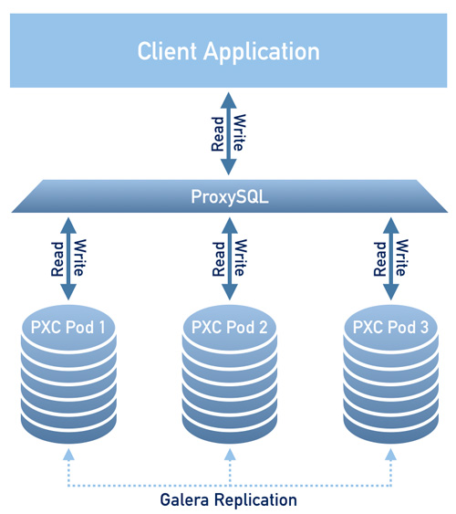
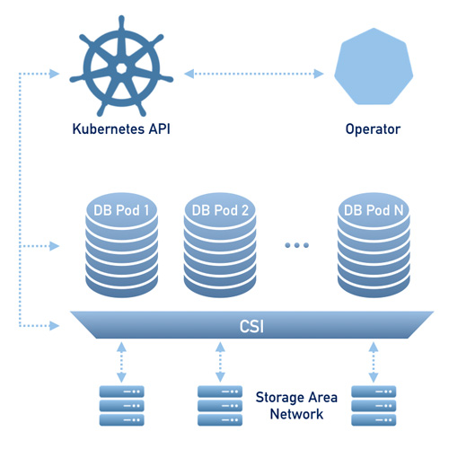

Design overview
================

*Percona XtraDB Cluster* integrates *Percona Server for MySQL* running with the XtraDB storage engine, and *Percona XtraBackup* with the *Galera library* to enable synchronous multi-master replication. 

The design of the operator is highly bound to the Percona XtraDB Cluster high availability implementation, which in its turn can be briefly described with the following diagram.

{: .align-center}

Being a regular MySQL Server instance, each node contains the same set of data synchronized accross nodes. The recommended configuration is to have at least 3 nodes. In a basic setup with this amount of nodes, Percona XtraDB Cluster provides high availability, continuing to function if you take any of the nodes down. Additionally load balancing can be achieved with the ProxySQL daemon, which accepts incoming traffic from MySQL clients and forwards it to backend MySQL servers.

**Note:** *Using ProxySQL results in [more efficient database workload management](https://proxysql.com/compare) in comparison with other load balancers which are not SQL-aware, including built-in ones of the cloud providers, or the Kubernetes NGINX Ingress Controller.*

To provide high availability operator uses [node affinity](https://kubernetes.io/docs/concepts/configuration/assign-pod-node/#affinity-and-anti-affinity) to run PXC instances on separate worker nodes if possible. If some node fails, the pod with it is automatically re-created on another node.

{: .align-center}

To provide data storage for the stateful applications, Kubernetes uses Persistent Volumes. A *PersistentVolumeClaim* (PVC) is used to implement the automatic storage provisioning to pods.  If a failure occurs, the Container Storage Interface (CSI) should be able to re-mount storage on a different node. So in our case PVC StorageClass should support this feature (Kubernetes and OpenShift support this in versions 1.9 and 3.9 respectively).

The operator functionality extends Kubernetes API with *PerconaServerPXC* object, and is implemented as a golang application. Each *PerconaServerPXC* object maps to one separate PXC setup. The operator listens to all events on the created objects. When a new PerconaServerPXC object is created, or an existing one undergoes some changes or deletion, the operator automatically creates/changes/deletes all needed Kubernetes objects with the appropriate settings to provide proper PXC operating.
